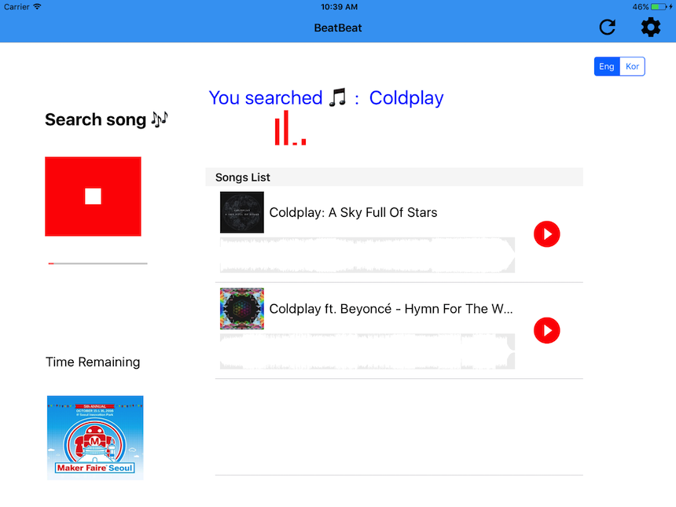

# BeatBeat iOS App

This app demonstrates how to make streaming gRPC connections to the [Cloud Speech API](https://cloud.google.com/speech/) to recognize speech in recorded audio.

It is modified to use with our Google Hackfair project! 

## Prerequisites
- An API key for the Cloud Speech API (See
  [the docs][getting-started] to learn more)
- An OSX machine or emulator
- [Xcode 8 beta 6][xcode] or later
- [Cocoapods][cocoapods] version 1.0 or later

## Quickstart
- Clone this repo and `cd` into this directory.
- Run `pod install` to download and build Cocoapods dependencies.
- Open the project by running `open BeatBeat.xcworkspace`.
- In `BeatBeat/SpeechRecognitionService.swift`, replace `YOUR_API_KEY` with the API key obtained above.
- In `BeatBeat/ViewController.swift`, replace `SOUNDCLOUD_CLIENT_ID` with the client ID obtained from Sound Cloud.
- Build and run the app.

## Running the app

- As with all Google Cloud APIs, every call to the Speech API must be associated
  with a project within the [Google Cloud Console][cloud-console] that has the
  Speech API enabled. This is described in more detail in the [getting started
  doc][getting-started], but in brief:
  - Create a project (or use an existing one) in the [Cloud
    Console][cloud-console]
  - [Enable billing][billing] and the [Speech API][enable-speech].
  - Create an [API key][api-key], and save this for later.

- Tap the `Speak` button. This uses a custom AudioController class to capture audio in an in-memory instance of NSMutableData. When this data reaches a certain size, it is sent to the SpeechRecognitionService class, which streams it to the speech recognition service. Packets are streamed as instances of the RecognizeRequest object, and the first RecognizeRequest object sent also includes configuration information in an instance of InitialRecognizeRequest. As it runs, the AudioController logs the number of samples and average sample magnitude for each packet that it captures.

- Say a few words and wait for the display to update when your speech is recognized.

- Tap the `Stop` button to stop capturing audio and close your gRPC connection.

- If you want to send the Sound cloud streaming URL to raspberry pi, enable socket in the settings. Also include 
SOCKET server address and port number! For seeing the actual response from Speech API, enable debug mode!

[vision-zip]: https://github.com/GoogleCloudPlatform/cloud-vision/archive/master.zip
[getting-started]: https://cloud.google.com/vision/docs/getting-started
[cloud-console]: https://console.cloud.google.com
[git]: https://git-scm.com/
[xcode]: https://developer.apple.com/xcode/
[billing]: https://console.cloud.google.com/billing?project=_
[enable-speech]: https://console.cloud.google.com/apis/api/speech.googleapis.com/overview?project=_
[api-key]: https://console.cloud.google.com/apis/credentials?project=_
[cocoapods]: https://cocoapods.org/
[gRPC Objective-C setup]: https://github.com/grpc/grpc/tree/master/src/objective-c

